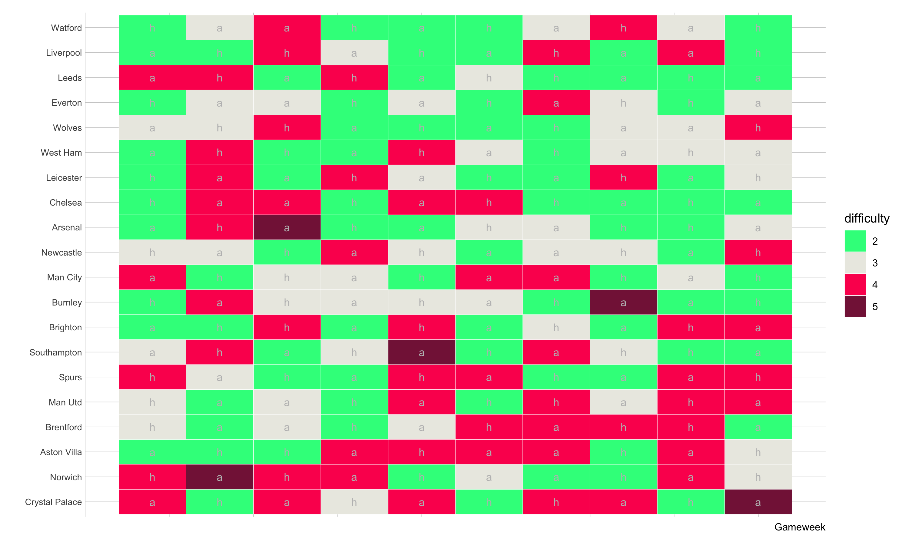

# FPLOptimiseR

## Installation
You can install FPLOptimiseR from github with:
``` r
# install.packages("devtools")
devtools::install_github('Chrisjb/fploptimiser')
```


# Usage

### fetch data
Get the historic player data from the FPL API for your own analysis
``` r
library(FPLOptimiseR)

df <- fetch_player_data()
```

Get expected points (adjusting for xG, xA and xCS) data from understat
``` r
df_xp <- fetch_xg_data()
```

Get expected clean sheets calculated with understat data:

``` r
Xclean_sheets <- fetch_xCS()
```


|team                    |xCS_per_game_h |xCS_per_game_a | total_xCS|value    |
|:-----------------------|:--------------|:--------------|---------:|:--------|
|Leicester               |0.44 (8)       |0.34 (8)       |       6.2|7 (0.8)  |
|Liverpool               |0.4 (8)        |0.37 (8)       |       6.2|3 (-3.2) |
|Manchester City         |0.4 (8)        |0.31 (8)       |       5.6|5 (-0.6) |
|Manchester United       |0.34 (8)       |0.35 (8)       |       5.5|2 (-3.5) |
|Wolverhampton Wanderers |0.28 (8)       |0.34 (8)       |       5.0|4 (-1)   |
|Everton                 |0.32 (8)       |0.25 (8)       |       4.6|3 (-1.6) |
|Tottenham               |0.4 (8)        |0.16 (8)       |       4.5|2 (-2.5) |
|Watford                 |0.32 (8)       |0.23 (8)       |       4.3|4 (-0.3) |
|Sheffield United        |0.36 (8)       |0.18 (8)       |       4.3|5 (0.7)  |
|Chelsea                 |0.42 (8)       |0.12 (8)       |       4.3|3 (-1.3) |
|Burnley                 |0.3 (8)        |0.22 (8)       |       4.2|5 (0.8)  |
|Brighton                |0.34 (8)       |0.18 (8)       |       4.1|4 (-0.1) |
|Arsenal                 |0.16 (8)       |0.31 (8)       |       3.7|2 (-1.7) |
|Crystal Palace          |0.34 (8)       |0.12 (8)       |       3.7|6 (2.3)  |
|Bournemouth             |0.24 (8)       |0.2 (8)        |       3.5|0 (-3.5) |
|Southampton             |0.2 (8)        |0.2 (8)        |       3.2|2 (-1.2) |
|Aston Villa             |0.22 (8)       |0.09 (8)       |       2.5|3 (0.5)  |
|Norwich                 |0.16 (8)       |0.15 (8)       |       2.5|2 (-0.5) |
|Newcastle United        |0.18 (8)       |0.11 (8)       |       2.3|4 (1.7)  |
|West Ham                |0.11 (8)       |0.07 (8)       |       1.4|4 (2.6)  |


### optimise team
Optimise your team for a given formation, team value, and assumed bench value. You'll want to have chosen your bench already (there is little point in optimising players on your bench as they will not earn you points a lot of the time).

You can optimise your team based on maximising total points from the historic dataset (full season by default) or points per game ('points' or 'ppg' respectively). If using 'ppg' you will want to set a `min_games` value  so that players with high points per game but with relatively few games played are avoided.

``` r
result <- optimise_team(objective = 'ppg', bank = 1000, bench_value = 170, gk = 1, def = 3, mid = 4, fwd = 3, min_games = 3)
```

#### Using expected points 
If we want to use expected points instead of actual points to optimise the team, we should first fetch the xg data and then we can feed that into the `custom_df` argument to `optimise_team`:

```r
df_xp <- fetch_xg_data()

result_xp <- optimise_team(objective = 'ppg', bank = 1000, bench_value = 170, gk = 1, def = 3, mid = 4, fwd = 3, min_games = 3, custom_df = df_xp)
```


### Getting fixtures

We can get and visualise fixtures for the next n games using:

```r
fixtures <- fetch_fixtures(n = 10)
```


|time       | gw| team_id|team_name   |ha |played |opponent       |difficulty | mean_difficulty| median_difficulty|
|:----------|--:|-------:|:-----------|:--|:------|:--------------|:----------|---------------:|-----------------:|
|2021-08-13 |  1|       1|Arsenal     |a  |FALSE  |Brentford      |2          |             2.8|               2.5|
|2021-08-14 |  1|       5|Burnley     |h  |FALSE  |Brighton       |2          |             2.9|               3.0|
|2021-08-14 |  1|       4|Brighton    |a  |FALSE  |Burnley        |2          |             2.9|               2.5|
|2021-08-14 |  1|       6|Chelsea     |h  |FALSE  |Crystal Palace |2          |             2.8|               2.0|
|2021-08-14 |  1|       8|Everton     |h  |FALSE  |Southampton    |2          |             2.7|               3.0|
|2021-08-14 |  1|       9|Leicester   |h  |FALSE  |Wolves         |2          |             2.8|               2.5|
|2021-08-14 |  1|      18|Watford     |h  |FALSE  |Aston Villa    |2          |             2.7|               2.5|
|2021-08-14 |  1|       2|Aston Villa |a  |FALSE  |Watford        |2          |             3.1|               3.5|
|2021-08-14 |  1|      11|Liverpool   |a  |FALSE  |Norwich        |2          |             2.7|               2.0|
|2021-08-15 |  1|      19|West Ham    |a  |FALSE  |Newcastle      |2          |             2.8|               3.0|


We can visualise the resulting fixture list:


```r
plot(fixtures)
```



It may be useful to know teams which have relatively uncorrelated fixtures (good for rotating substitutes):

```r
fixtures <- fixture_rotation(fixtures)
```


|team1          |team2          |       cor|
|:--------------|:--------------|---------:|
|Liverpool      |Crystal Palace | 0.6755111|
|Crystal Palace |Leeds          | 0.6755111|
|Chelsea        |Crystal Palace | 0.6805447|
|Chelsea        |Newcastle      | 0.6998542|
|Chelsea        |Everton        | 0.7013344|
|Everton        |Liverpool      | 0.7114582|
|Everton        |Leeds          | 0.7114582|
|Burnley        |Chelsea        | 0.7356619|
|Brighton       |Newcastle      | 0.7419985|
|Aston Villa    |Liverpool      | 0.7419985|


